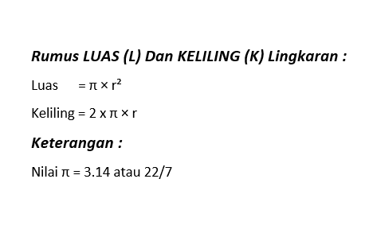

# Menghitung_Luas_Dan_Keliling_Lingkaran
## Rumus Luas Dan Keliling lingkaran

> Luas     = π × r² 

> Keliling = 2 x π × r 

> Nilai phi yang di gunakan adalah 3.14 

> r Merupakan jari-jari lingkaran 

Phi merupakan nilai konstanta dalam matematika yang merupakan perbandingan keliling lingkaran dengan diameternya. phi memiliki nilai 3,14 atau 22/7. namun program ini saya buat menggunakan nilai 3,14. Sementara jari-jari merupakan jarak antara titik pusat dengan tepi lingkaran. Sebetulnya ada rumus lain untuk menghitung keliling lingkaran yaitu dengan menggunakan diameter, tapi pada kasus ini kita cukup menggunakan jari jari lingkaran saja. 

### Flowchart Menghitung Luas Dan Keliling lingkaran
![]

### Program Menghitung Luas Dan Keliling Lingkaran
!

### Penjelasan
Selanjutnya kita memerlukan nilai jari-jari (r) yang nantinya akan di masukan oleh pengguna pada layar console. Kita menggunakan fungsi input() yang nilainya di konversi ke tipe data float (bilangan riil). Ingat bahwa fungsi input() akan menganggap semua nilai inputan bertipe string, sehingga kita perlu melakukan konversi ke tipe yang diinginkan. 

Ketika kita sudah mendapat nilai phi dan jari-jari selanjutnya kita bisa menghitung luas dan keliling sesuai dengan rumus-nya. 

Selanjutnya kita tampilkan hasilnya dengan fungsi print(). sintak \t merupakan karakter espace yang berfungsi untuk membuat tab. dalam kasus ini agar sejajar karakter sama dengan (=) nya. 

Jika dilihat hasil luas dan keliling lingkaran mempunyai angka pecahan yang cukup banyak, untuk mengambil 2 angka pecahan saja kita pakai fungsi format() seperti gambar di atas. 

### Output
!

### Sekian Terima Kasih